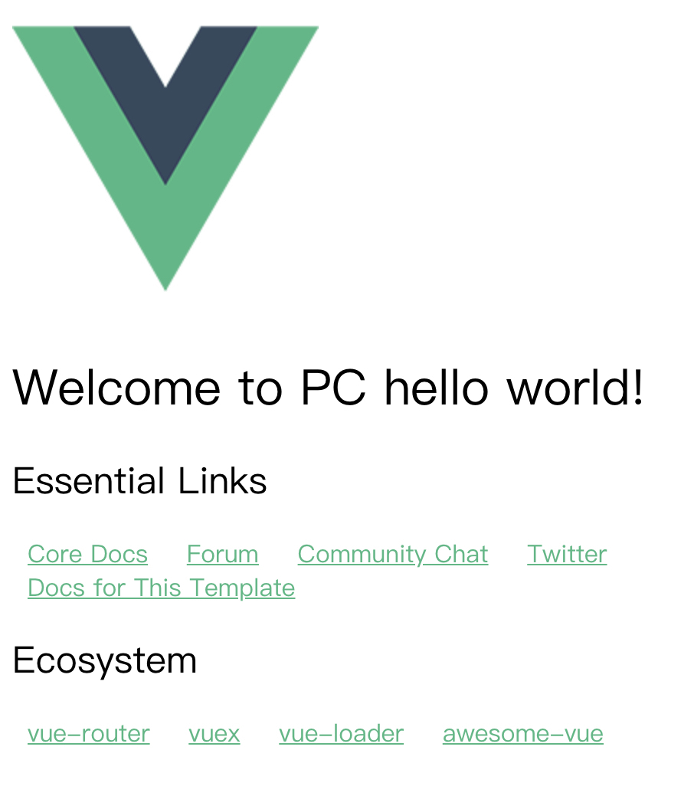
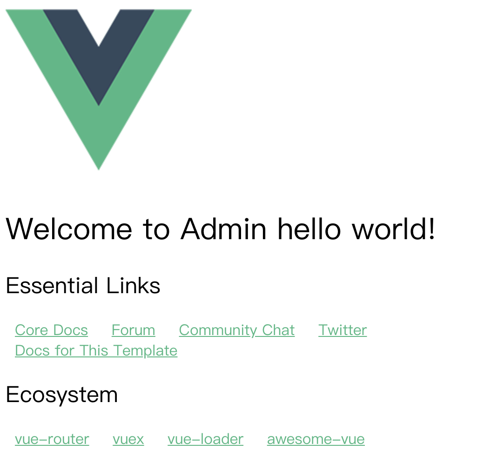

# Multi-Vue-Webpack-Entry-Template

This repo is a vue-webpack template project with multiple entries (pc and admin). 

The project was inited with [vuejs-templates](http://vuejs-templates.github.io/webpack/) and made some modifications on it.

## Setup project

```bash
npm install  # install dependency
npm run dev  # develop
npm run build  # build
```

## Run with brower

After run `npm run dev`, we can probe `pc` terminal and `admin` terminal. 

Open `http://localhost:8081/pc.html#/`, we can get:



Open `http://localhost:8081/admin.html#/`, we can get:

